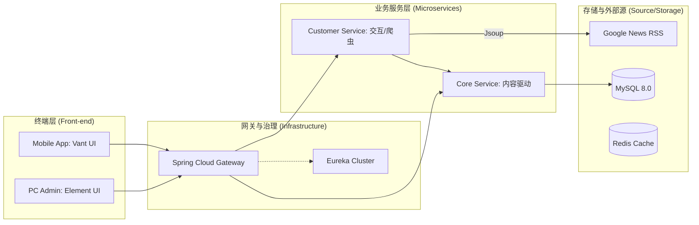

# 全球新闻资讯综合管理与服务平台 (NewsPulse)

本项目是一个功能极其完备、架构先进的**全栈新闻生态系统**。它不仅实现了从自动化内容采集、多级审核、到全平台（PC/移动端）分发的闭环，还集成了数据可视化、实时任务调度和精细化社交互动功能。

---

## 1. 系统核心功能大观

### 🚀 1.1 管理员端：PC 综合管理后台 (news_vue)
基于 **Vue 2 + Element UI** 构建，专为决策与运营打造的高端管理终端。

- **📊 数字化决策中心**: 
  - 集成 **amCharts5** 引擎，提供极具视觉冲击力的新闻主题分布饼图。
  - 实时统计注册用户数、主题数及资讯总量，掌握平台运行脉搏。
- **⚙️ 核心逻辑管控**:
  - **新闻全生命周期管理**: 包含从抓取后的“待审核”到发布、撤回、删除的完整流程。
  - **精细化评论审计**: 实时拦截或批准用户评论，维护社区健康。
  - **主题与公告系统**: 一键定义频道分类；发布具备多级优先级、针对不同人群（用户/内部）的系统公告。
- **👮 系统安全与 RBAC**:
  - 超级管理员可对普通管理员进行入职审计与权限管控。
  - 全面的普通用户账户管理，保障平台秩序。
- **📡 新闻脉冲 (Pulse Console)**: 
  - **可视化爬虫终端**: 集成了类 Terminal 的黑色控制台，实时流式输出新闻抓取日志。
  - **任务灵活配置**: 支持指定分类抓取、设置爬取上限，任务异步执行，不阻塞 UI。

### 📱 1.2 用户端：响应式 H5 移动应用 (newsmobile)
基于 **Vue 2 + Vant UI** 开发，专注于极致的阅读体验与社交互动。

- **📰 流畅阅读体验**:
  - 沉浸式首页：红色视觉基调，集成多主题滑动切换与高清大图轮播。
  - 无限加载：支持数万级新闻数据的流畅瀑布流滚动。
- **🤝 深度社交互动**:
  - **点赞/收藏引擎**: 实时同步文章热度，个人中心可随时检索收藏内容。
  - **高级评论系统**: 支持**嵌套式回复**（Reply-to-Reply）、**匿名发表**、评论点赞，以及个人评论的实时状态跟踪（待审/通过）。
- **👣 智能行为追踪**:
  - 自动记录每篇读过文章的详细足迹，方便用户回拾阅读记忆。
- **👤 个人档案中心**:
  - 手机号登录，集成 MD5 数据安全网，支持头像与个人信息更新。

### ⚙️ 1.3 后端：Spring Cloud 微服务大脑 (newsmanager202512)
支撑整个平台运行的高性能、高可用微服务集群。

- **🏗️ 现代微服务架构**: 
  - **Eureka**: 实现高可用的服务治理与自动发现。
  - **Gateway**: 统一流量分发，实现动态路由映射。
  - **Core/Customer 分离**: 核心业务与高频交互解耦，提升系统弹性。
- **🕷️ Java 原生集成爬虫**:
  - 基于 **Jsoup** 开发，深度集成于 Spring Cloud 环境中。
  - 能够自动化解析标准 RSS 与 HTML 结构，实现自动去重、格式化入库。
- **🔒 安全设计**: 
  - 密码全流程 MD5 摘要存储，拒绝明文。
  - 完善的 RestTemplate 负载均衡调用机制。
- **📄 自治文档系统**: 集成 `springdoc-openapi`，自动生成交互式 Swagger 文档。

---

## 2. 技术架构全景



---

## 3. 目录结构指南

```text
news/
├── news_vue/               # [NEW] 管理后台：PC 端 Element UI 源码
├── newsmobile/             # [NEW] 移动应用：基于 Vue 的 H5 客户端
├── newsmanager202512/      # Java 后端主干
│   ├── newsmanager-eureka/ # 服务注册中心
│   ├── newsmanager-gateway/# 全局 API 网关
│   ├── newsmanager-customer/# 社交互动模块 + 【Java 内嵌爬虫控制中心】
│   ├── newsmanger-core/    # 核心内容资产管理模块
│   └── newsmanager-api/    # 公共 DTO 与接口规范库
├── newsweb/                # 基础预览网页（备用）
└── news_system.sql        # 一键还原数据库
```

---

## 4. 核心亮点总结

1.  **全链路 Java 化**: 彻底告别外部脚本，爬虫直接作为 Spring 服务运行，管理更透明。
2.  **多端共治**: 专为手机设计的 H5 和专为办公设计的 PC 后台相映成趣。
3.  **视觉化冲击**: 丰富的图表统计、逼真的终端日志输出。
4.  **社交颗粒度**: 支持嵌套评论和异步状态展示，还原真实社交场景。
