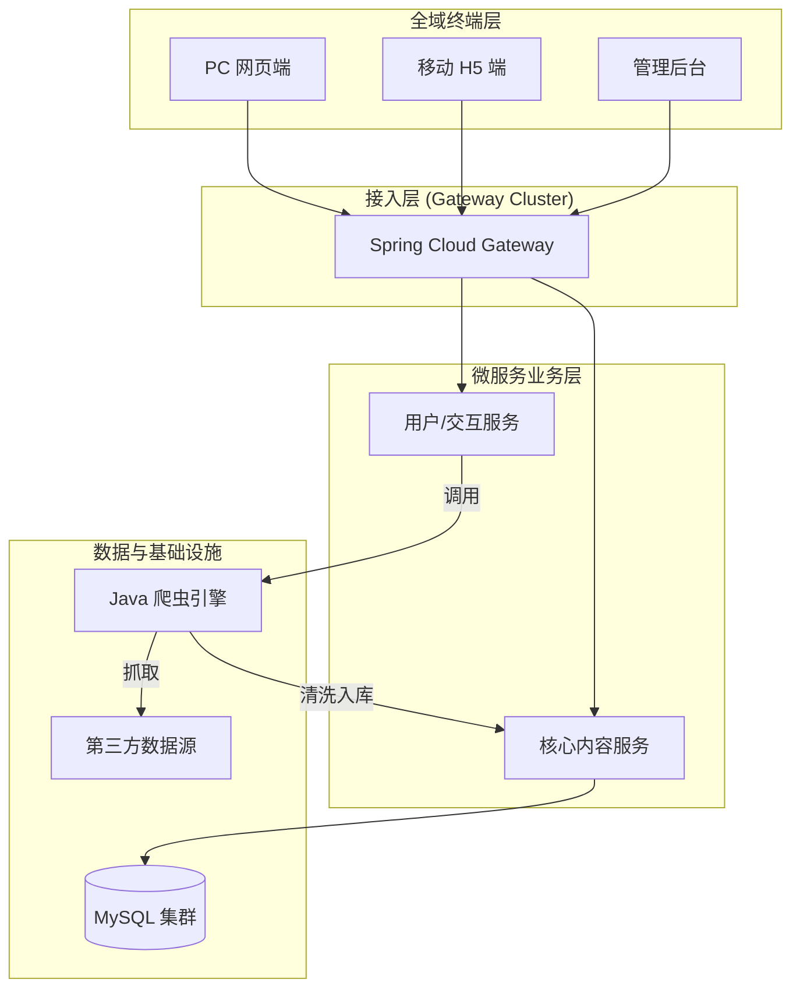

# 全球新闻资讯综合管理与服务平台 (NewsPulse)

本项目是一个技术架构先进、覆盖全终端场景的**企业级新闻生态系统**。它完美融合了 **Spring Cloud 微服务**、**Java 原生爬虫引擎**，并提供**PC 网页 + 移动 H5 + 后台管理**三大独立交互终端，实现了从内容生产到全域分发的完整闭环。

---

## 1. 三大核心终端全景

### 🌍 1.1 PC 网页端 (Web Client - newsweb)
面向传统互联网用户的标准门户入口，采用 **HTML + jQuery + CSS3** 经典架构。
- **🏛️ 门户级交互体验**:
  - 实时的“新闻滚动公告”栏。
  - 经典的三栏式布局（国内/国际/娱乐分栏），符合用户深度阅读习惯。
- **🔐 完整功能闭环**:
  - **验证码登录/注册体系**: 安全便捷的手机号认证流程。
  - **沉浸式阅读**: 支持字号调整、夜间模式及相关性推荐。
  - **个人资产管理**: 独立的“我的收藏”与“浏览足迹”管理面板。

### 📱 1.2 移动端 (Mobile App - newsmobile)
面向移动互联网用户的**响应式 H5 应用**，基于 **Vue 2 + Vant UI** 构建。
- **✨ 现代化交互设计**:
  - **瀑布流无限加载**: 毫秒级响应的手势滑动体验。
  - **社交化功能**: 支持嵌套式评论（盖楼）、点赞动画及一键分享。
- **📰 智能分发**:
  - 首页轮播图热点推送。
  - 基于用户习惯的个性化推荐流。

### 📊 1.3 管理员端 (Admin Console - news_vue)
专为运营团队打造的 **SPA 单页管理系统**，基于 **Vue 2 + Element UI**。
- **📈 可视化决策**: 集成 **amCharts**，实时展示用户增长曲线与内容分布饼图。
- **🕷️ 爬虫控制台**: 黑客风格的实时日志终端，可远程控制 Java 爬虫任务。
- **👮 RBAC 权限体系**: 严格的超级管理员/普通管理员分级鉴权机制。

---

## 2. 技术架构全景



---

## 3. 技术栈详情

### 🔧 后端技术栈

| 类别 | 技术 | 版本 |
|------|------|------|
| **构建工具** | Maven | 3.6.3 |
| **JDK** | JDK | 17 |
| **核心框架** | Spring Boot | 3.5.9 |
| **ORM** | MyBatis + MyBatis-Plus | 3.5.7 |
| **数据库** | MySQL | 9.4.0 |
| **缓存** | Redis | 3.2.100 |
| **微服务** | Spring Cloud | 2025.0.1 |
| **服务注册** | Netflix Eureka | 3节点集群 |
| **API网关** | Spring Cloud Gateway | (WebFlux) |
| **负载均衡** | Spring Cloud LoadBalancer | - |
|              |                           |           |
| **API文档** | Swagger | 2.6.0 |
| **实体简化** | Lombok | 1.18.30 |
| **工具类** | Apache Commons Lang3 | 3.18.0 |
| **架构规范** | COLA Component DTO | 4.3.2 |
| **HTML解析** | JSoup | 1.18.1 |

### 🌐 前端技术栈

| 类别 | 技术 | 版本 |
|------|------|------|
| **基础** | HTML5 + CSS3 | - |
| **核心框架** | Vue.js | 2.6.14 |
| **路由** | Vue Router | 3.5.1 |
| **HTTP请求** | Axios | 1.13.2 |
| **移动端UI** | Vant UI | 2.13.9 |
| **后台管理UI** | Element UI | 2.15.14 |
| **图表** | amCharts 5 | 5.15.1 |
| **地图可视化** | amCharts Geodata | 5.1.5 |
| **地图** | 百度地图 (BMAP) | - |
| **跨平台** | UniApp | - |
| **DOM操作** | jQuery | 1.12.4 |
| **构建工具** | Vue CLI | 5.0.0 |
| **代码转译** | Babel | 7.12.16 |
| **代码规范** | ESLint | 7.32.0 |

---

## 4. 核心技术亮点

1.  **全终端覆盖**: 无论是桌面浏览还是手机碎片时间，或是后台重度管理，均有独立且专业的客户端支持。
2.  **Java 原生采集**: 摒弃 Python 脚本，爬虫逻辑作为 `@Service` 深度集成于 Java 服务中，可直接复用 Spring 上下文和事务控制。
3.  **微服务治理**: 完整的 Eureka + Gateway 体系，保障高并发下的服务稳定性。
4.  **数据可视化**: 管理后台引入专业图表库，让运营数据一目了然。

---

## 5. 目录结构说明

```text
news/
├── newsweb/                # [核心] PC 网页端门户 (HTML/jQuery)
├── newsmobile/             # [核心] 移动端 H5 应用 (Vue/Vant)
├── news_vue/               # [核心] 后台管理系统 (Vue/Element)
├── newsmanager202512/      # Java 后端微服务集群
│   ├── newsmanager-eureka/ # 服务发现
│   ├── newsmanager-gateway/# 网关路由
│   ├── newsmanger-core/    # 核心业务
│   └── newsmanager-customer/# 交互业务 + 爬虫引擎
└── news_system.sql        # 初始化脚本
```
