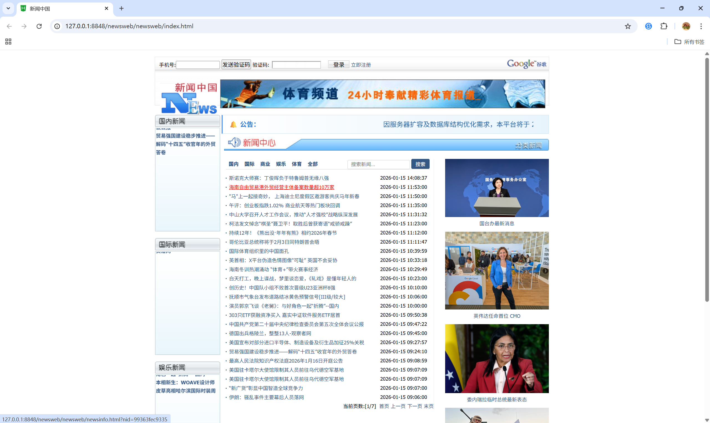
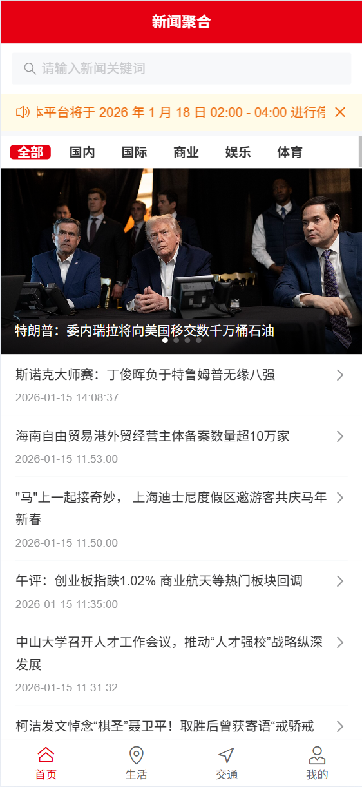
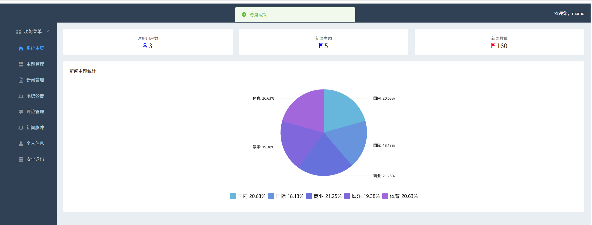
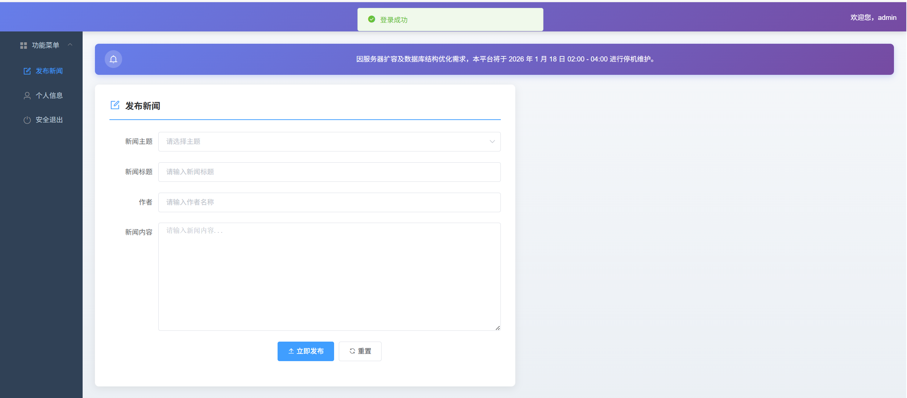

# 全球新闻资讯综合管理与服务平台 (NewsPulse)

<p align="center">
  <a href="./README.md">🌐 English</a> | CN中文
</p>

本项目是一个技术架构先进、覆盖全终端场景的**企业级新闻生态系统**。它完美融合了 **Spring Cloud 微服务**、**Java 原生爬虫引擎**，并提供**PC 网页 + 移动 H5 + 后台管理**三大独立交互终端，实现了从内容生产到全域分发的完整闭环。

---

## 1. 三大核心终端全景

### 🌍 1.1 PC 网页端 (Web Client - newsweb)
面向传统互联网用户的标准门户入口，采用 **HTML + jQuery + CSS3** 经典架构。
- **🏛️ 门户级交互体验**:
  - 实时的"新闻滚动公告"栏，自动滚动展示最新系统公告。
  - 经典的三栏式布局（国内/国际/娱乐分栏），符合用户深度阅读习惯。
  - 新闻列表分页浏览，支持按分类筛选。
- **🔐 完整用户体系**:
  - **验证码登录/注册体系**: 安全便捷的手机号认证流程。
  - **沉浸式阅读**: 新闻详情页展示完整内容，包含作者来源、发布时间等元信息。
- **💼 个人资产管理**:
  - **我的收藏**: 独立的收藏列表管理页面，支持关键词搜索。
  - **浏览足迹**: 完整的历史浏览记录追溯功能。
- **💬 社交互动**:
  - **点赞功能**: 对喜欢的新闻一键点赞。
  - **评论系统**: 用户可对新闻发表评论，支持匿名评论。

### 📱 1.2 移动端 (Mobile App - newsmobile)
面向移动互联网用户的**响应式 H5 应用**，基于 **Vue 2 + Vant UI** 构建。
- **✨ 现代化交互设计**:
  - **瀑布流信息流**: 毫秒级响应的手势滑动体验，无限滚动加载。
  - **底部导航栏**: 首页、生活、交通、我的四大功能模块快速切换。
  - **首页轮播图**: 热点新闻图片推送，动态展示精选内容。
- **📰 智能内容呈现**:
  - **分类 Tab 筛选**: 按主题快速筛选新闻内容。
  - **新闻详情**: 沉浸式阅读体验，展示完整新闻内容与元信息。
- **💬 社交化功能**:
  - **嵌套式评论系统**: 支持多级回复的"盖楼"式评论，可对评论进行层层回复。
  - **点赞/收藏**: 一键操作，同步状态指示。
  - **浏览历史自动记录**: 访问新闻自动记入历史足迹。
- **👤 个人中心**:
  - **登录/注册弹窗**: 流畅的表单验证与用户认证流程。
  - **我的收藏**: 收藏列表展示，支持关键词搜索与滑动删除。
  - **我的足迹**: 浏览历史记录，便于回顾已读内容。
  - **统计展示**: 收藏数、浏览数一目了然。

### 📊 1.3 管理员端 (Admin Console - news_vue)
专为运营团队打造的 **SPA 单页管理系统**，基于 **Vue 2 + Element UI**。
- **📈 可视化数据看板**:
  - **核心统计卡片**: 注册用户数、新闻主题数、新闻总量实时展示。
  - **amCharts 饼图**: 新闻主题分布可视化，直观呈现内容结构。
- **📂 内容管理**:
  - **主题管理**: 新增/删除新闻分类主题。
  - **新闻管理**: 完整的新闻列表，支持分页、排序、状态筛选。
    - 新闻审核（通过/撤回）
    - 新闻删除
    - 按日期批量删除（超级管理员权限）
- **💬 评论治理**:
  - **评论列表管理**: 分页展示，支持按时间排序。
  - **评论审核**: 通过/撤回/删除评论。
  - **🤖 AI 智能审核**: 集成大模型，一键批量分析评论内容，智能识别违规/正常评论并给出审核建议（通过/拦截/需人工审核），支持一键采纳 AI 建议。
- **📢 公告系统**:
  - **公告发布/编辑/删除**: 完整的公告 CRUD 操作。
  - **展示控制**: 可设置展示对象（用户端/管理员/所有人）、优先级（高/中/低）、展示状态开关。
- **🕷️ 新闻脉冲 (爬虫控制台)**:
  - **可视化爬虫任务配置**: 选择采集分类、设置单类上限。
  - **实时日志终端**: 黑客风格的终端界面，实时滚动显示采集日志。
  - **异步采集**: 后台运行，不阻塞页面操作。
- **👮 权限管理**:
  - **RBAC 分级体系**: 超级管理员/普通管理员权限分离。
  - **管理员管理**: 审核通过/撤回/删除普通管理员账号。
  - **用户管理**: 查看/删除注册用户。

---

## 2. 技术栈详情

### 🔧 后端技术栈

| 类别 | 技术 | 版本 |
|------|------|------|
| **构建工具** | Maven | 3.6.3 |
| **JDK** | JDK | 17 |
| **核心框架** | Spring Boot | 3.5.9 |
| **ORM** | MyBatis + MyBatis-Plus | 3.5.7 |
| **数据库** | MySQL | 9.4.0 |
| **缓存** | Redis | 3.2.1 |
| **微服务** | Spring Cloud | 2025.0.1 |
| **服务注册** | Netflix Eureka | 3节点集群 |
| **API网关** | Spring Cloud Gateway |  |
| **API文档** | Swagger | 2.6.0 |
| **实体简化** | Lombok | 1.18.30 |
| **工具类**   | Apache Commons Lang3   | 3.18.0    |
| **架构规范** | COLA Component DTO     | 4.3.2     |
| **HTML解析** | JSoup                  | 1.18.1    |

### 🌐 前端技术栈

| 类别 | 技术 | 版本 |
|------|------|------|
| **基础** | HTML5 + CSS3 | - |
| **核心框架** | Vue.js | 2.6.14 |
| **路由** | Vue Router | 3.5.1 |
| **HTTP请求** | Axios | 1.13.2 |
| **移动端UI** | Vant UI | 2.13.9 |
| **后台管理UI** | Element UI | 2.15.14 |
| **图表** | amCharts 5 | 5.15.1 |
| **地图可视化** | amCharts Geodata | 5.1.5 |
| **地图** | 百度地图 (BMAP) | - |
| **跨平台** | UniApp | - |
| **DOM操作** | jQuery | 1.12.4 |
| **构建工具** | Vue CLI | 5.0.0 |
| **代码转译** | Babel | 7.12.16 |
| **代码规范** | ESLint | 7.32.0 |

---

## 3. 核心技术亮点

1.  **全终端覆盖**: 无论是桌面浏览还是手机碎片时间，或是后台重度管理，均有独立且专业的客户端支持。
2.  **Java 原生采集**: 摒弃 Python 脚本，爬虫逻辑作为 `@Service` 深度集成于 Java 服务中，可直接复用 Spring 上下文和事务控制。
3.  **微服务治理**: 完整的 Eureka + Gateway 体系，保障高并发下的服务稳定性。
4.  **数据可视化**: 管理后台引入专业图表库 amCharts，让运营数据一目了然。
5.  **AI 内容审核**: 集成 AI 大模型对用户评论进行智能分析，自动识别违规内容，提升运营效率。
6.  **敏感词过滤**: 内置多维度敏感词库（广告、涉枪涉爆、网址、骂人词库等），保障内容安全。
7.  **嵌套评论体系**: 支持多级回复的评论系统，提升用户互动体验。

---

## 4. 目录结构说明

```text
news/
├── newsweb/                # [核心] PC 网页端门户 (HTML/jQuery)
│   └── newsweb/
│       ├── index.html      # 首页
│       ├── newsinfo.html   # 新闻详情页
│       ├── collection.html # 我的收藏
│       ├── history.html    # 浏览足迹
│       └── regist.html     # 注册页面
├── newsmobile/             # [核心] 移动端 H5 应用 (Vue/Vant)
│   └── src/views/
│       ├── HomeView.vue    # 首页（信息流+轮播图）
│       ├── NewsDetail.vue  # 新闻详情（含评论区）
│       ├── MyView.vue      # 个人中心
│       ├── LifeView.vue    # 生活频道
│       └── TrafficView.vue # 交通频道
├── news_vue/               # [核心] 后台管理系统 (Vue/Element)
│   └── src/views/
│       ├── HomeView.vue    # 登录页
│       ├── AdminView.vue   # 管理中心（含所有管理功能）
│       └── CustomerView.vue# 用户端预览
├── newsmanager202512/      # Java 后端微服务集群
│   ├── newsmanager-eureka/ # 服务注册中心 (7001/7002/7003)
│   ├── newsmanager-gateway/# API 网关路由
│   ├── newsmanger-core/    # 核心业务服务
│   │   └── controller/
│   │       ├── NewsController.java      # 新闻管理
│   │       ├── CommentController.java   # 评论管理
│   │       ├── CollectionController.java# 收藏管理
│   │       ├── LikeController.java      # 点赞管理
│   │       ├── HistoryController.java   # 浏览记录
│   │       ├── NoticeController.java    # 公告管理
│   │       ├── ThemeController.java     # 主题管理
│   │       ├── AdminController.java     # 管理员管理
│   │       ├── UserController.java      # 用户管理
│   │       ├── AIController.java        # AI 审核接口
│   │       └── TotalController.java     # 统计接口
│   └── newsmanager-customer/# 用户交互服务 + 爬虫引擎
│       └── controller/
│           ├── NewsCrawlerController.java # 爬虫控制
│           ├── NoticeController.java      # 通知推送
│           └── ...                        # 其他交互接口
├── sensitive-stop-words/   # 敏感词库
│   ├── 广告.txt
│   ├── 涉枪涉爆违法信息关键词.txt
│   ├── 网址.txt
│   ├── 骂人词库.txt
│   └── stopword.dic
└── news_system.sql         # 数据库初始化脚本
```

---

## 5. 快速开始

### 5.1 环境要求
- JDK 17+
- Maven 3.6+
- MySQL 8.0+
- Redis 3.2+
- Node.js 25+

### 5.2 后端启动
1. 导入 `news_system.sql` 初始化数据库
2. 依次启动 Eureka 集群 (7001/7002/7003)
3. 启动 Gateway 网关服务
4. 启动 Core 和 Customer 业务服务

### 5.3 前端启动
```bash
# PC 网页端 - 直接用浏览器打开 newsweb/newsweb/index.html

# 移动端
cd newsmobile
npm install
npm run serve

# 管理后台
cd news_vue
npm install
npm run serve
```

---

## 6. 功能截图

### 6.1 PC 网页端首页

<div align="center">
  
  <p><em>图 6-1 网页端首页 - 三栏式布局，新闻分类展示</em></p>
</div>

### 6.2 移动端效果

<div align="center">
  
  <p><em>图 6-2 移动端 H5 应用 - 信息流+底部导航</em></p>
</div>

### 6.3 管理后台 - 超级管理员

<div align="center">
  
  <p><em>图 6-3 超级管理员视图 - 完整功能权限</em></p>
</div>

### 6.4 管理后台 - 普通管理员

<div align="center">
  
  <p><em>图 6-4 普通管理员视图 - 受限功能权限</em></p>
</div>

---

## 7. License

MIT License © 2024-2026
